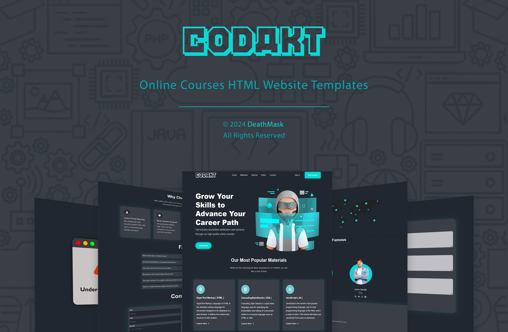

<div align="center">
<h2 align="center">Codakt  -  online courses website template</h2>
Codakt is a fully responsive online courses website template, responsive for all devices, built using HTML, CSS, and JavaScript.
<br />
<br />
<a href="https://codewithsadee.github.io/funel-agency_landing_page/"><strong>➥ Live Demo</strong></a>
<br />
<br />
</div>

## Demo



## Prerequisites

Before you begin, ensure you have met the following requirements:

* [Git](https://git-scm.com/downloads "Download Git") must be installed on your operating system.

## Installing Codakt

To install **Codakt**, follow these steps:

Linux and macOS:

```bash
sudo git clone https://github.com/Death-Mask/Codakt.git
```

Windows:

```bash
git clone https://github.com/Death-Mask/Codakt.git
```

## Contact

<p align="left">
  <a href="https://www.linkedin.com/in/ahmed-abd-alalim-286768299/" target="_blank"></a>
<!--   <a href="https://github.com/Death-Mask" target="_blank"></a> -->
  
</p>

## License

This program has been licensed under the MIT License. If you are a true FOSS (Free And Open Source Software) Lover, you wont customize this and redistribute this under your name
